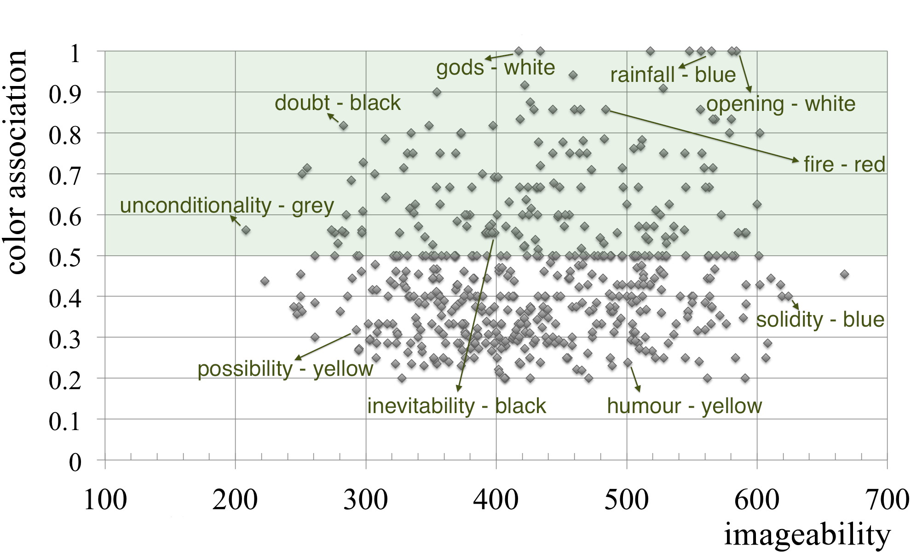
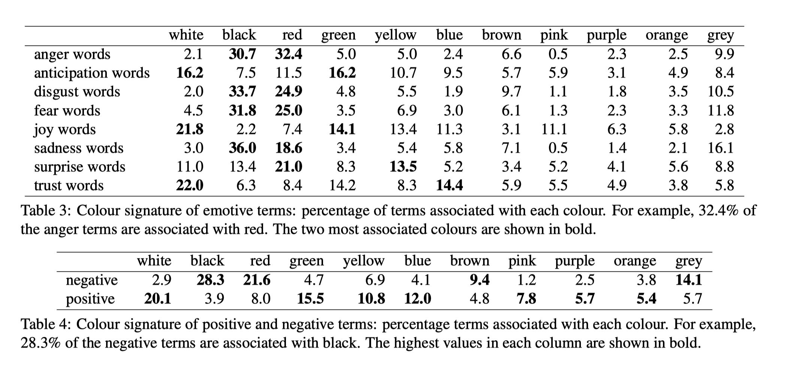
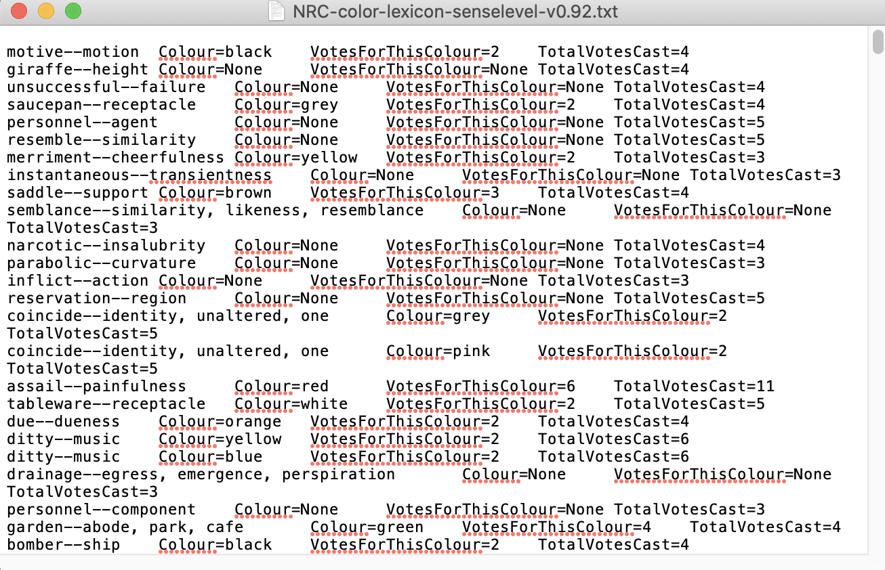
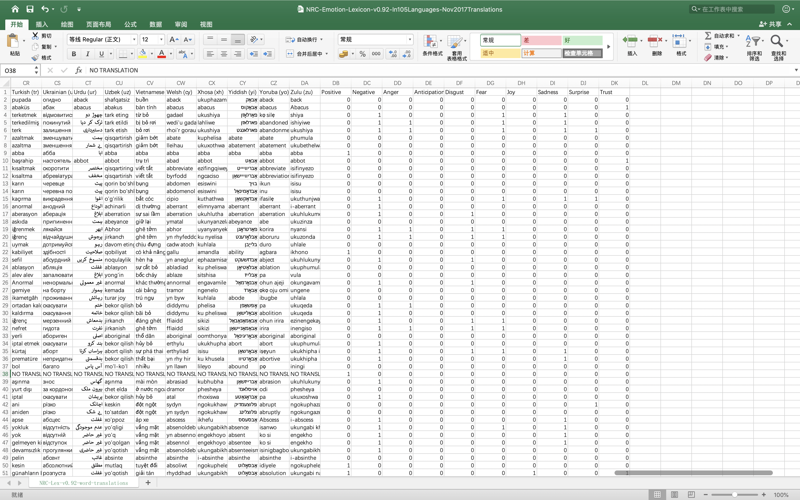

**情绪和情感词典** 是由加拿大国家研究委员会（简称NRC）的专家创建。 该词典·具有广泛的应用程序开发，可以在多种环境中使用，例如情绪分析，产品营销，消费者行为，甚至是政治活动分析。

该技术使用一系列单词来帮助识别情绪，情感，并分析标签，表情符号和单词颜色的关联。 这些词典包含英文单词的条目，可用于分析英文文本。

资源文件夹目录(文章末尾有完整的资源可供下载)  
- AutomaticallyGeneratedLexicons
- NRC-Affect-Intensity-Lexicon
- NRC-Colour-Lexicon-v0.92
- NRC-Emotion-Lexicon-v0.92
- NRC-VAD-Lexicon

但是我觉得目前对咱们经管专业最有用可能
- NRC-Colour-Lexicon-v0.92
- NRC-Emotion-Lexicon-v0.92

### 词语的颜色（NRC-Colour-Lexicon-v0.92）
颜色是成功传递信息的重要组成部分，无论是在销售商业产品（Sable和Akcay，2010），设计网页（Meier，1988； Pribadi等，1990）还是可视化信息（Christ，1975）中 ； Card等，1999）。 由于实际概念与某些颜色类别（例如，红色危险和粉红色柔和度）相关联，因此使用适当的颜色来补充语言和非语言信息会带来很多好处，包括：

- 加强讯息（改善语义连贯性）
- 减轻接收者的认知负担
- 快速传达信息
- 唤起所需的情绪反应

例如考虑在停车标志中使用红色，驾驶员能够更快地识别该标志，并且会引起与危险有关的潜意识情绪，同样，使用红色标注高犯罪率的区域是很好地使用颜色的例子。 另一方面，不恰当的使用颜色可能更有害于理解（Marcus，1982； Meier，1988）。

大多数语言中许多表达情感的词语都有涉及色彩的表达， 在英语中的例子包括：
- 嫉妒的绿色
- 贵族的蓝色血统
- 牧场的绿色（更好的大道）
- 黄腹（怯co的）
- 红地毯（特殊处理）
- 透过玫瑰色眼镜看（乐观）。 

此外，不断出现新的表达方式，例如灰色和比安卡·马斯登（Bianca Marsden）的诗《混乱》中的不确定性。 因此，**概念-颜色关联的知识** 对于自动自然语言系统（例如，文本含义，释义，机器翻译和情感分析）也可能有用。

当颜色是单词所指概念的显着特征时，或者因为该单词与此类概念相关，则单词与颜色具有很强的关联性。许多概念-颜色关联，例如天鹅与白色和蔬菜与绿色，都涉及物理实体。但是，即使是抽象的概念和情感也可能具有与社会相关的色彩（诚实–白色，危险–红色，喜悦–黄色，愤怒–红色）。此外，许多协会是特定于文化的（Gage，1969； Chen，2005）。例如，在亚洲大部分地区，繁荣与红色有关。

不幸的是，没有一个词库能够捕获概念-颜色的关联，并且仍然存在许多问题，例如人类对这些关联的共识程度以及物理概念是否更可能具有颜色关联比抽象的我们期望单词-颜色关联在文本和语音中表现为共现，但是还没有研究表明单词在多大程度上与关联的颜色共存，而不是与其他颜色共存。

研究发现：

- 超过30％的术语具有强烈的颜色关联（第4节）
- 约33％的词库类别具有很强的颜色关联（第5节）。
- 抽象术语几乎与物理实体一样具有颜色关联（第6节）。
- 情绪和极性与颜色有很强的联系（第7节）。
- 词色关联在WordNet中表现为紧密（程度较小），在文本中表现为较高的同时出现率（程度较大）（第8节）。

最后，我们提出一种自动方法来确定单词-颜色关联，该方法依赖于共现和极性提示，但没有标记的单词-颜色关联信息。可获得超过60％的精度。相比之下，随机选择和最频繁的班级监督基准分别仅获得9.1％和33.3％。这样的方法可以用来创建其他语言的相似词典。

### 英文颜色词典txt
词语颜色词典目前只有英文版，截图如下

### 词语的情绪（NRC-Emotion-Lexicon-v0.92）

情绪通常通过不同的面部表情来表达（亚里士多德，1913；拉塞尔，1994）。 不同的情感也通过不同的语言表达。 例如
- 愉悦和好吃表明喜悦的情绪
- 忧郁和哭泣表明悲伤
- 呼喊和沸腾表明愤怒
- 等等

本情绪词典支持包括英语、法语、阿拉伯语、中文和西班牙语等在内的105种语言。

### 105种语言的情绪词典
情绪词典是基于英文数据，但扩展为105种语言。如下图，excel有105列+9列，其中前105列是同一个意思在105种语言但不同表达。

后9列是积极、消极及7种情绪(喜怒哀乐愁怨恨)

>http://sentiment.nrc.ca/lexicons-for-research/
>[1]Saif, Mohammad. "Colourful Language: Measuring Word-Colour Associations, 2011a." In Proceedings of the ACL 2011 Workshop on Cognitive Modeling and Computational Linguistics (CMCL). 2011.
>[2]Mohammad, Saif M., and Peter D. Turney. "Crowdsourcing a word–emotion association lexicon." Computational Intelligence 29, no. 3 (2013): 436-465.

NRC词典下载链接:https://pan.baidu.com/s/1JhR5e13gD2N-KyQNdqO1gA  密码:uufw

